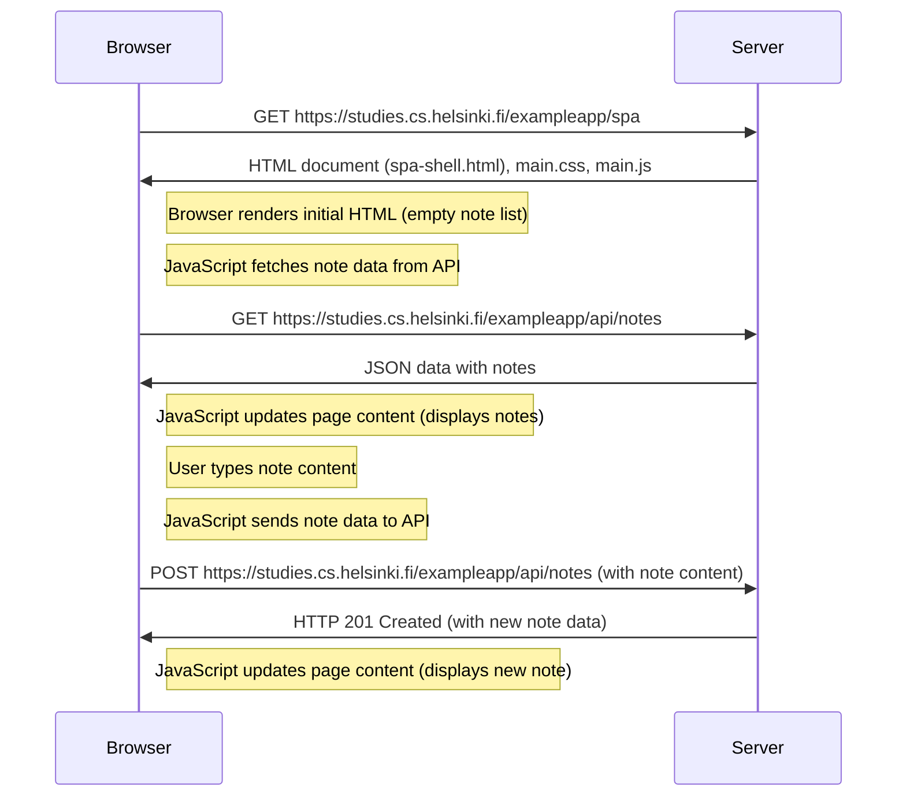

```mermaid
sequenceDiagram
    participant Browser
    participant Server

    Browser->>Server: GET https://studies.cs.helsinki.fi/exampleapp/spa
    Server->>Browser: HTML document (spa-shell.html), main.css, main.js
    Note right of Browser: Browser renders initial HTML (empty note list)
    Note right of Browser: JavaScript fetches note data from API
    Browser->>Server: GET https://studies.cs.helsinki.fi/exampleapp/api/notes
    Server->>Browser: JSON data with notes
    Note right of Browser: JavaScript updates page content (displays notes)
    Note right of Browser: User types note content
    Note right of Browser: JavaScript sends note data to API
    Browser->>Server: POST https://studies.cs.helsinki.fi/exampleapp/api/notes (with note content)
    Server->>Browser: HTTP 201 Created (with new note data)
    Note right of Browser: JavaScript updates page content (displays new note)

```