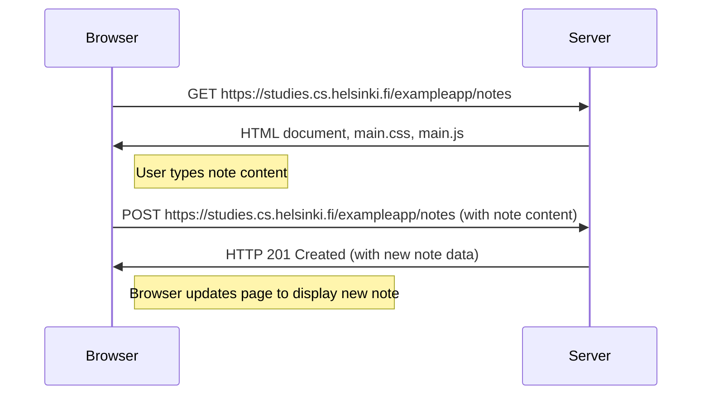

```mermaid
sequenceDiagram
    participant Browser
    participant Server

    Browser->>Server: GET https://studies.cs.helsinki.fi/exampleapp/notes
    Server->>Browser: HTML document, main.css, main.js
    Note right of Browser: User types note content
    Browser->>Server: POST https://studies.cs.helsinki.fi/exampleapp/notes (with note content)
    Server->>Browser: HTTP 201 Created (with new note data)
    Note right of Browser: Browser updates page to display new note

```
